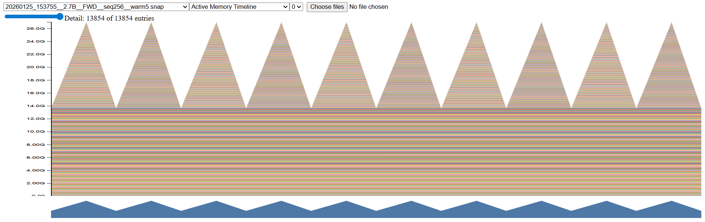
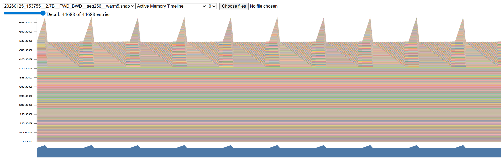

# CS336 Spring 2025 Assignment 2: Systems - Analysis Report

## Profiling

### Basic benchmarking Results

> based on `benchmark_results__5090.md`

| Config | Seq Len | Warmup Steps | d_model |  d_ff | n_layers | num_heads | Status FWD | Status FWD+BWD | Total(s) FWD | Total(s) FWD+BWD | Warmup(s) FWD | Warmup(s) FWD+BWD | Avg/Step(s) FWD | Avg/Step(s) FWD+BWD | Std/Step(s) FWD | Std/Step(s) FWD+BWD |
| :----- | ------: | -----------: | ------: | ----: | -------: | --------: | :--------- | :------------- | -----------: | ---------------: | ------------: | ----------------: | --------------: | ------------------: | --------------: | ------------------: |
| small  |     128 |            0 |     768 |  3072 |       12 |        12 | OK         | OK             |       1.0023 |           1.2453 |             0 |                 0 |          0.0668 |               0.083 |        0.216775 |            0.124395 |
| small  |     128 |            1 |     768 |  3072 |       12 |        12 | OK         | OK             |        0.975 |            1.248 |        0.8252 |            0.5291 |          0.0107 |              0.0513 |         0.00181 |             0.00799 |
| small  |     128 |            5 |     768 |  3072 |       12 |        12 | OK         | OK             |       0.9851 |           1.2351 |        0.8761 |            0.6769 |          0.0109 |              0.0558 |        0.002056 |            0.004872 |
| small  |     256 |            0 |     768 |  3072 |       12 |        12 | OK         | OK             |       1.0414 |           1.2672 |             0 |                 0 |          0.0694 |              0.0845 |        0.215732 |            0.127523 |
| small  |     256 |            1 |     768 |  3072 |       12 |        12 | OK         | OK             |       1.0085 |           1.2514 |         0.825 |            0.5286 |          0.0131 |              0.0516 |        0.003709 |            0.006786 |
| small  |     256 |            5 |     768 |  3072 |       12 |        12 | OK         | OK             |       1.0072 |           1.3504 |        0.8887 |            0.7437 |          0.0119 |              0.0607 |         3.4e-05 |             0.00593 |
| small  |     512 |            0 |     768 |  3072 |       12 |        12 | OK         | OK             |       1.1365 |            1.392 |             0 |                 0 |          0.0758 |              0.0928 |        0.212369 |            0.121347 |
| small  |     512 |            1 |     768 |  3072 |       12 |        12 | OK         | OK             |       1.0731 |           1.3859 |        0.8273 |            0.5344 |          0.0176 |              0.0608 |        0.002892 |            0.002008 |
| small  |     512 |            5 |     768 |  3072 |       12 |        12 | OK         | OK             |        1.101 |           1.3767 |        0.9204 |            0.7638 |          0.0181 |              0.0613 |        0.003814 |            0.001623 |
| small  |    1024 |            0 |     768 |  3072 |       12 |        12 | OK         | OK             |        1.509 |             2.84 |             0 |                 0 |          0.1006 |              0.1893 |        0.205508 |            0.120335 |
| small  |    1024 |            1 |     768 |  3072 |       12 |        12 | OK         | OK             |       1.5142 |           2.8371 |        0.8497 |            0.6225 |          0.0475 |              0.1582 |        0.000623 |            0.000174 |
| small  |    1024 |            5 |     768 |  3072 |       12 |        12 | OK         | OK             |       1.5418 |           2.8312 |        1.0676 |             1.248 |          0.0474 |              0.1583 |        0.000495 |            0.000485 |
| medium |     128 |            0 |    1024 |  4096 |       24 |        16 | OK         | OK             |       1.1948 |           1.9575 |             0 |                 0 |          0.0796 |              0.1305 |        0.221662 |            0.128232 |
| medium |     128 |            1 |    1024 |  4096 |       24 |        16 | OK         | OK             |        1.195 |           1.9319 |        0.8836 |            0.5972 |          0.0222 |              0.0953 |        0.003978 |            0.012665 |
| medium |     128 |            5 |    1024 |  4096 |       24 |        16 | OK         | OK             |       1.2178 |            1.949 |        0.9998 |            0.9369 |          0.0218 |              0.1012 |        0.001429 |             0.00528 |
| medium |     256 |            0 |    1024 |  4096 |       24 |        16 | OK         | OK             |       1.3428 |           2.0675 |             0 |                 0 |          0.0895 |              0.1378 |        0.229779 |            0.126324 |
| medium |     256 |            1 |    1024 |  4096 |       24 |        16 | OK         | OK             |       1.3478 |           2.0783 |        0.9265 |             0.604 |          0.0301 |              0.1053 |        0.006274 |            0.005216 |
| medium |     256 |            5 |    1024 |  4096 |       24 |        16 | OK         | OK             |       1.3606 |            2.112 |        1.0808 |            1.0427 |           0.028 |              0.1069 |        0.001225 |            0.004758 |
| medium |     512 |            0 |    1024 |  4096 |       24 |        16 | OK         | OK             |       1.6291 |           3.1863 |             0 |                 0 |          0.1086 |              0.2124 |        0.225688 |            0.127486 |
| medium |     512 |            1 |    1024 |  4096 |       24 |        16 | OK         | OK             |       1.6152 |           3.1583 |        0.9113 |            0.6598 |          0.0503 |              0.1785 |        0.003004 |            0.002339 |
| medium |     512 |            5 |    1024 |  4096 |       24 |        16 | OK         | OK             |       1.6232 |           3.1381 |        1.1262 |            1.3567 |          0.0497 |              0.1781 |        0.000231 |            0.000944 |
| medium |    1024 |            0 |    1024 |  4096 |       24 |        16 | OOM        | OOM            |          nan |              nan |           nan |               nan |             nan |                 nan |             nan |                 nan |
| medium |    1024 |            1 |    1024 |  4096 |       24 |        16 | OOM        | OOM            |          nan |              nan |           nan |               nan |             nan |                 nan |             nan |                 nan |
| medium |    1024 |            5 |    1024 |  4096 |       24 |        16 | OOM        | OOM            |          nan |              nan |           nan |               nan |             nan |                 nan |             nan |                 nan |
| large  |     128 |            0 |    1280 |  5120 |       36 |        20 | OK         | OK             |       1.5116 |            2.993 |             0 |                 0 |          0.1008 |              0.1995 |        0.229969 |            0.144448 |
| large  |     128 |            1 |    1280 |  5120 |       36 |        20 | OK         | OK             |       1.4998 |           2.9996 |        0.9195 |            0.7097 |          0.0414 |              0.1636 |        0.007115 |            0.005697 |
| large  |     128 |            5 |    1280 |  5120 |       36 |        20 | OK         | OK             |       1.5041 |           2.9977 |        1.1123 |            1.3507 |          0.0392 |              0.1647 |        0.000193 |               0.001 |
| large  |     256 |            0 |    1280 |  5120 |       36 |        20 | OK         | OK             |       1.7686 |           3.6186 |             0 |                 0 |          0.1179 |              0.2412 |        0.231367 |            0.133437 |
| large  |     256 |            1 |    1280 |  5120 |       36 |        20 | OK         | OK             |       1.7756 |           3.6202 |        0.9612 |            0.7216 |          0.0582 |               0.207 |        0.009429 |            0.001389 |
| large  |     256 |            5 |    1280 |  5120 |       36 |        20 | OK         | OK             |       1.7699 |           3.6449 |        1.2078 |            1.5692 |          0.0562 |              0.2076 |        0.001835 |            0.001967 |
| large  |     512 |            0 |    1280 |  5120 |       36 |        20 | OOM        | OOM            |          nan |              nan |           nan |               nan |             nan |                 nan |             nan |                 nan |
| large  |     512 |            1 |    1280 |  5120 |       36 |        20 | OOM        | OOM            |          nan |              nan |           nan |               nan |             nan |                 nan |             nan |                 nan |
| large  |     512 |            5 |    1280 |  5120 |       36 |        20 | OOM        | OOM            |          nan |              nan |           nan |               nan |             nan |                 nan |             nan |                 nan |
| large  |    1024 |            0 |    1280 |  5120 |       36 |        20 | OOM        | OOM            |          nan |              nan |           nan |               nan |             nan |                 nan |             nan |                 nan |
| large  |    1024 |            1 |    1280 |  5120 |       36 |        20 | OOM        | OOM            |          nan |              nan |           nan |               nan |             nan |                 nan |             nan |                 nan |
| large  |    1024 |            5 |    1280 |  5120 |       36 |        20 | OOM        | OOM            |          nan |              nan |           nan |               nan |             nan |                 nan |             nan |                 nan |
| xl     |     128 |            0 |    1600 |  6400 |       48 |        25 | OK         | OOM            |       1.9182 |              nan |             0 |               nan |          0.1279 |                 nan |        0.231533 |                 nan |
| xl     |     128 |            1 |    1600 |  6400 |       48 |        25 | OK         | OOM            |       1.9049 |              nan |        0.9652 |               nan |          0.0671 |                 nan |        0.008872 |                 nan |
| xl     |     128 |            5 |    1600 |  6400 |       48 |        25 | OK         | OOM            |       1.9103 |              nan |        1.2565 |               nan |          0.0654 |                 nan |        0.001968 |                 nan |
| xl     |     256 |            0 |    1600 |  6400 |       48 |        25 | OOM        | OOM            |          nan |              nan |           nan |               nan |             nan |                 nan |             nan |                 nan |
| xl     |     256 |            1 |    1600 |  6400 |       48 |        25 | OOM        | OOM            |          nan |              nan |           nan |               nan |             nan |                 nan |             nan |                 nan |
| xl     |     256 |            5 |    1600 |  6400 |       48 |        25 | OOM        | OOM            |          nan |              nan |           nan |               nan |             nan |                 nan |             nan |                 nan |
| xl     |     512 |            0 |    1600 |  6400 |       48 |        25 | OOM        | OOM            |          nan |              nan |           nan |               nan |             nan |                 nan |             nan |                 nan |
| xl     |     512 |            1 |    1600 |  6400 |       48 |        25 | OOM        | OOM            |          nan |              nan |           nan |               nan |             nan |                 nan |             nan |                 nan |
| xl     |     512 |            5 |    1600 |  6400 |       48 |        25 | OOM        | OOM            |          nan |              nan |           nan |               nan |             nan |                 nan |             nan |                 nan |
| xl     |    1024 |            0 |    1600 |  6400 |       48 |        25 | OOM        | OOM            |          nan |              nan |           nan |               nan |             nan |                 nan |             nan |                 nan |
| xl     |    1024 |            1 |    1600 |  6400 |       48 |        25 | OOM        | OOM            |          nan |              nan |           nan |               nan |             nan |                 nan |             nan |                 nan |
| xl     |    1024 |            5 |    1600 |  6400 |       48 |        25 | OOM        | OOM            |          nan |              nan |           nan |               nan |             nan |                 nan |             nan |                 nan |
| 2.7B   |     128 |            0 |    2560 | 10240 |       32 |        32 | OK         | OOM            |       2.1486 |              nan |             0 |               nan |          0.1432 |                 nan |         0.22732 |                 nan |
| 2.7B   |     128 |            1 |    2560 | 10240 |       32 |        32 | OK         | OOM            |        2.136 |              nan |         0.955 |               nan |          0.0844 |                 nan |        0.002824 |                 nan |
| 2.7B   |     128 |            5 |    2560 | 10240 |       32 |        32 | OK         | OOM            |       2.1625 |              nan |        1.3247 |               nan |          0.0838 |                 nan |        0.000205 |                 nan |
| 2.7B   |     256 |            0 |    2560 | 10240 |       32 |        32 | OOM        | OOM            |          nan |              nan |           nan |               nan |             nan |                 nan |             nan |                 nan |
| 2.7B   |     256 |            1 |    2560 | 10240 |       32 |        32 | OOM        | OOM            |          nan |              nan |           nan |               nan |             nan |                 nan |             nan |                 nan |
| 2.7B   |     256 |            5 |    2560 | 10240 |       32 |        32 | OOM        | OOM            |          nan |              nan |           nan |               nan |             nan |                 nan |             nan |                 nan |
| 2.7B   |     512 |            0 |    2560 | 10240 |       32 |        32 | OOM        | OOM            |          nan |              nan |           nan |               nan |             nan |                 nan |             nan |                 nan |
| 2.7B   |     512 |            1 |    2560 | 10240 |       32 |        32 | OOM        | OOM            |          nan |              nan |           nan |               nan |             nan |                 nan |             nan |                 nan |
| 2.7B   |     512 |            5 |    2560 | 10240 |       32 |        32 | OOM        | OOM            |          nan |              nan |           nan |               nan |             nan |                 nan |             nan |                 nan |
| 2.7B   |    1024 |            0 |    2560 | 10240 |       32 |        32 | OOM        | OOM            |          nan |              nan |           nan |               nan |             nan |                 nan |             nan |                 nan |
| 2.7B   |    1024 |            1 |    2560 | 10240 |       32 |        32 | OOM        | OOM            |          nan |              nan |           nan |               nan |             nan |                 nan |             nan |                 nan |
| 2.7B   |    1024 |            5 |    2560 | 10240 |       32 |        32 | OOM        | OOM            |          nan |              nan |           nan |               nan |             nan |                 nan |             nan |                 nan |

#### Analysis

The table above shows benchmark results for different model configurations across various sequence lengths. Results include both forward-only (inference) and forward+backward (training) passes. Time is recorded and measured with python's time module.

#### Warm up

The first step is cost longer time than the rest. With warm up, the time of train or inference are stable.

### Nsys Profile Analysis

> based on nsys reports with run tag `new_base`

#### (a) Forward Pass Timing

Forward Pass Avg Time (ms)

| Model  | seq128 | seq256 | seq512 | seq1024 |
| ------ | ------ | ------ | ------ | ------- |
| small  | 75.04  | 82.42  | 81.12  | 108.34  |
| medium | 93.19  | 98.42  | 117.96 | OOM     |
| large  | 113.67 | 128.50 | OOM    | OOM     |
| xl     | 141.89 | OOM    | OOM    | OOM     |
| 2.7B   | 154.74 | OOM    | OOM    | OOM     |

The time of nsys is a little slower than python version. A reasonable explanation is profiling overhead and run-to-run variance; the NVTX ranges are measured under the profiler and can be slower even if the benchmark uses torch.cuda.synchronize().

#### (b) Dominant Kernels (iteration 6)

small Top Kernel per Pass

| Seq Len | Inference Forward                    | Training Forward                     | Training Backward                    |
| ------- | ------------------------------------ | ------------------------------------ | ------------------------------------ |
| seq128  | void cutlass::Kernel2<cut... (58.2%) | void cutlass::Kernel2<cut... (58.3%) | void cutlass::Kernel2<cut... (17.0%) |
| seq256  | void cutlass::Kernel2<cut... (52.5%) | void cutlass::Kernel2<cut... (52.6%) | void cutlass::Kernel2<cut... (24.0%) |
| seq512  | void cutlass::Kernel2<cut... (72.1%) | void cutlass::Kernel2<cut... (71.0%) | void cutlass::Kernel2<cut... (25.6%) |
| seq1024 | void cutlass::Kernel2<cut... (40.8%) | void cutlass::Kernel2<cut... (41.3%) | void cutlass::Kernel2<cut... (15.2%) |

medium Top Kernel per Pass

| Seq Len | Inference Forward                    | Training Forward                     | Training Backward                    |
| ------- | ------------------------------------ | ------------------------------------ | ------------------------------------ |
| seq128  | void cutlass::Kernel2<cut... (48.6%) | void cutlass::Kernel2<cut... (49.2%) | void cutlass::Kernel2<cut... (29.4%) |
| seq256  | void cutlass::Kernel2<cut... (56.6%) | void cutlass::Kernel2<cut... (56.2%) | void cutlass::Kernel2<cut... (25.7%) |
| seq512  | void cutlass::Kernel2<cut... (50.5%) | void cutlass::Kernel2<cut... (48.8%) | void cutlass::Kernel2<cut... (26.9%) |
| seq1024 | OOM                                  | OOM                                  | OOM                                  |

large Top Kernel per Pass

| Seq Len | Inference Forward                    | Training Forward                     | Training Backward                    |
| ------- | ------------------------------------ | ------------------------------------ | ------------------------------------ |
| seq128  | void cutlass::Kernel2<cut... (56.1%) | void cutlass::Kernel2<cut... (55.5%) | void cutlass::Kernel2<cut... (29.6%) |
| seq256  | void cutlass::Kernel2<cut... (60.0%) | void cutlass::Kernel2<cut... (59.6%) | void cutlass::Kernel2<cut... (25.2%) |
| seq512  | OOM                                  | OOM                                  | OOM                                  |
| seq1024 | OOM                                  | OOM                                  | OOM                                  |

xl Top Kernel per Pass

| Seq Len | Inference Forward                    | Training Forward | Training Backward |
| ------- | ------------------------------------ | ---------------- | ----------------- |
| seq128  | void cutlass::Kernel2<cut... (60.4%) | OOM              | OOM               |
| seq256  | OOM                                  | OOM              | OOM               |
| seq512  | OOM                                  | OOM              | OOM               |
| seq1024 | OOM                                  | OOM              | OOM               |

2.7B Top Kernel per Pass

| Seq Len | Inference Forward                    | Training Forward | Training Backward |
| ------- | ------------------------------------ | ---------------- | ----------------- |
| seq128  | void cutlass::Kernel2<cut... (93.2%) | OOM              | OOM               |
| seq256  | OOM                                  | OOM              | OOM               |
| seq512  | OOM                                  | OOM              | OOM               |
| seq1024 | OOM                                  | OOM              | OOM               |

The dominant kernel is always GEMM for matrix multiplication. Forward's GEMM ratio is larger than backward's because backward has more non-GEMM kernels (e.g., elementwise ops for gradients). As seq_len increases, non-GEMM kernels (e.g., elementwise ops) become more prominent due to more activations and intermediate results.

#### (c) Non-GEMM Kernels in Forward Pass

small Top Non-GEMM Kernel per Sequence Length

| Seq Len | Top Non-GEMM Kernel                         | Time% | Total    | Inst |
| ------- | ------------------------------------------- | ----- | -------- | ---- |
| seq128  | void at::native::elementwise_kernel<(int... | 1.9%  | 1.74 ms  | 720  |
| seq256  | void at::native::elementwise_kernel<(int... | 2.3%  | 2.86 ms  | 720  |
| seq512  | void at::native::elementwise_kernel<(int... | 4.0%  | 9.28 ms  | 360  |
| seq1024 | void at::native::elementwise_kernel<(int... | 13.1% | 90.05 ms | 360  |

medium Top Non-GEMM Kernel per Sequence Length

| Seq Len | Top Non-GEMM Kernel                         | Time% | Total    | Inst |
| ------- | ------------------------------------------- | ----- | -------- | ---- |
| seq128  | void at::native::elementwise_kernel<(int... | 2.1%  | 4.24 ms  | 1440 |
| seq256  | void at::native::elementwise_kernel<(int... | 2.2%  | 7.19 ms  | 1440 |
| seq512  | void at::native::elementwise_kernel<(int... | 5.3%  | 37.36 ms | 720  |
| seq1024 | OOM                                         | -     | -        | -    |

large Top Non-GEMM Kernel per Sequence Length

| Seq Len | Top Non-GEMM Kernel                         | Time% | Total    | Inst |
| ------- | ------------------------------------------- | ----- | -------- | ---- |
| seq128  | void at::native::elementwise_kernel<(int... | 1.7%  | 7.41 ms  | 2160 |
| seq256  | void at::native::elementwise_kernel<(int... | 2.0%  | 14.63 ms | 2160 |
| seq512  | OOM                                         | -     | -        | -    |
| seq1024 | OOM                                         | -     | -        | -    |

xl Top Non-GEMM Kernel per Sequence Length

| Seq Len | Top Non-GEMM Kernel                         | Time% | Total    | Inst |
| ------- | ------------------------------------------- | ----- | -------- | ---- |
| seq128  | void at::native::elementwise_kernel<(int... | 1.5%  | 11.42 ms | 2880 |
| seq256  | OOM                                         | -     | -        | -    |
| seq512  | OOM                                         | -     | -        | -    |
| seq1024 | OOM                                         | -     | -        | -    |

2.7B Top Non-GEMM Kernel per Sequence Length

| Seq Len | Top Non-GEMM Kernel                         | Time% | Total    | Inst |
| ------- | ------------------------------------------- | ----- | -------- | ---- |
| seq128  | void at::native::vectorized*elementwise*... | 1.0%  | 11.76 ms | 960  |
| seq256  | OOM                                         | -     | -        | -    |
| seq512  | OOM                                         | -     | -        | -    |
| seq1024 | OOM                                         | -     | -        | -    |

The most time-consuming non-GEMM kernels are element wise copy, as seq length increases, elementwise kernels (activations, copy, etc.) take a larger proportion of time due to more data being processed.

#### (d) GEMM Fraction: Inference vs Training

small GEMM Fraction

| Seq Len | Inference | Training |
| ------- | --------- | -------- |
| seq128  | 88.0%     | 59.3%    |
| seq256  | 84.6%     | 61.1%    |
| seq512  | 80.0%     | 53.5%    |
| seq1024 | 53.7%     | 31.0%    |

medium GEMM Fraction

| Seq Len | Inference | Training |
| ------- | --------- | -------- |
| seq128  | 87.0%     | 58.9%    |
| seq256  | 85.4%     | 63.5%    |
| seq512  | 77.1%     | 55.1%    |
| seq1024 | OOM       | OOM      |

large GEMM Fraction

| Seq Len | Inference | Training |
| ------- | --------- | -------- |
| seq128  | 89.6%     | 59.4%    |
| seq256  | 87.8%     | 64.7%    |
| seq512  | OOM       | OOM      |
| seq1024 | OOM       | OOM      |

xl GEMM Fraction

| Seq Len | Inference | Training |
| ------- | --------- | -------- |
| seq128  | 91.2%     | OOM      |
| seq256  | OOM       | OOM      |
| seq512  | OOM       | OOM      |
| seq1024 | OOM       | OOM      |

2.7B GEMM Fraction

| Seq Len | Inference | Training |
| ------- | --------- | -------- |
| seq128  | 94.4%     | OOM      |
| seq256  | OOM       | OOM      |
| seq512  | OOM       | OOM      |
| seq1024 | OOM       | OOM      |

Non-GEMM kernels become more significant as sequence length increases.

Training has a lower GEMM fraction than inference due to additional non-GEMM operations in the backward pass (e.g., elementwise ops for gradients).

As model size increases, GEMM fraction tends to increase because larger models have more compute-intensive matrix multiplications relative to non-GEMM ops.

#### (e) Softmax vs Matmul in Attention (iteration 6)

Softmax Time (ms)

| Model  | seq128 | seq256 | seq512 | seq1024 |
| ------ | ------ | ------ | ------ | ------- |
| small  | 0.70   | 0.75   | 1.20   | 11.95   |
| medium | 1.47   | 1.63   | 4.65   | OOM     |
| large  | 2.23   | 2.42   | OOM    | OOM     |
| xl     | 3.10   | OOM    | OOM    | OOM     |
| 2.7B   | 2.01   | OOM    | OOM    | OOM     |

Matmul Time (ms)

| Model  | seq128 | seq256 | seq512 | seq1024 |
| ------ | ------ | ------ | ------ | ------- |
| small  | 1.53   | 1.41   | 2.40   | 8.69    |
| medium | 3.07   | 3.20   | 6.30   | OOM     |
| large  | 3.60   | 4.75   | OOM    | OOM     |
| xl     | 5.81   | OOM    | OOM    | OOM     |
| 2.7B   | 3.67   | OOM    | OOM    | OOM     |

Softmax/Matmul Ratio

| Model  | seq128 | seq256 | seq512 | seq1024 |
| ------ | ------ | ------ | ------ | ------- |
| small  | 45.9%  | 52.9%  | 49.8%  | 137.6%  |
| medium | 48.0%  | 50.9%  | 73.9%  | OOM     |
| large  | 62.0%  | 50.9%  | OOM    | OOM     |
| xl     | 53.3%  | OOM    | OOM    | OOM     |
| 2.7B   | 55.0%  | OOM    | OOM    | OOM     |

Bigger seq length, softmax time increases faster than matmul time, leading to a higher softmax/matmul ratio. This is because softmax involves more elementwise operations and reductions that scale quadratically with sequence length, while matmul benefits from optimized GPU kernels.

For one head and one batch, softmax FLOPs per row is 5mn; across attention this is 5 x seq x seq. Computing attention scores is 2 x seq x head_dim x seq, and the final matmul is the same, so total matmul FLOPs is 4 x seq x head_dim x seq. The FLOPs ratio is (5 x seq x seq) : (4 x seq x head_dim x seq) = 5 : (4 x head_dim). In our medium config, head_dim = 64, so the ratio is 5 : 256, about 1.95%.

```shell
m x (n-1)  get row max
m x n      minus max
m x n      exp
m x (n-1)  get sum
m x n      divide
```

The time spent computing softmax is much higher than its FLOPs ratio, likely because softmax is elementwise and memory-bound (more memory traffic), while GEMM kernels are highly optimized and more compute-bound. A possible improvement is to use a fused kernel to avoid intermediate softmax stores/loads, trading a bit more compute for less memory access.

### Mix precision

#### Mixed_precision_accumulation

```python
import torch

s = torch.tensor(0, dtype=torch.float32)
for i in range(1000):
    s += torch.tensor(0.01, dtype=torch.float32)
print(s)  # tensor(10.0001)

s = torch.tensor(0, dtype=torch.float16)
for i in range(1000):
    s += torch.tensor(0.01, dtype=torch.float16)
print(s)  # tensor(9.9531, dtype=torch.float16)

s = torch.tensor(0, dtype=torch.float32)
for i in range(1000):
    s += torch.tensor(0.01, dtype=torch.float16)
print(s)  # tensor(10.0021)

s = torch.tensor(0, dtype=torch.float32)
for i in range(1000):
    x = torch.tensor(0.01, dtype=torch.float16)
    s += x.type(torch.float32)
print(s)  # tensor(10.0021)
```

#### Parameters and outputs dtypes under different autocast types

Auto cast with torch.float16:

```shell
Paramater's dtype in autocast: torch.float32
Output of fc1 dtype : torch.float16
Output of fc2 dtype : torch.float16
Output of relu dtype : torch.float16
Output of ln dtype : torch.float32
Model's logits dtype : torch.float16
Loss dtype : torch.float32
Gradient dtype of first layer weights: torch.float32
```

Auto cast with torch.bfloat16:

```shell
Paramater's dtype in autocast: torch.float32
Output of fc1 dtype : torch.bfloat16
Output of fc2 dtype : torch.bfloat16
Output of relu dtype : torch.bfloat16
Output of ln dtype : torch.float32
Model's logits dtype : torch.bfloat16
Loss dtype : torch.float32
Gradient dtype of first layer weights: torch.float32
```

#### LayerNorm

The reason layerNorm remaing float32 is that layerNorm involves reductions (mean/stddev) which can lose precision in float16; PyTorch's autocast keeps such ops in float32 to maintain numerical stability.

Although BF16 has sufficient dynamic range (same 8 exponent bits as FP32), PyTorch autocast conservatively keeps LayerNorm in float32 for both FP16 and BF16. Theoretically BF16 could be used for LayerNorm, but the precision loss (7 mantissa bits vs 23) may affect training stability.

#### Mixed Precision Analysis

##### Forward Pass Comparison (Median Time in ms)

| Model  | Full Precision | BF16 Mixed | Speedup |
| ------ | -------------- | ---------- | ------- |
| small  | 75.89          | 79.35      | 0.96x   |
| medium | 94.93          | 103.34     | 0.92x   |
| large  | 115.40         | 123.42     | 0.94x   |
| xl     | 144.16         | 146.84     | 0.98x   |
| 2.7B   | 155.02         | 629.84     | 0.25x   |

##### Forward+Backward Pass Comparison (Median Time in ms)

| Model  | Full Precision | BF16 Mixed | Speedup |
| ------ | -------------- | ---------- | ------- |
| small  | 85.71          | 105.35     | 0.81x   |
| medium | 119.69         | 141.50     | 0.85x   |
| large  | 156.81         | 180.92     | 0.87x   |

##### Attention Score Computation (Median Time in ms)

| Model  | Full Precision | BF16 Mixed | Speedup |
| ------ | -------------- | ---------- | ------- |
| small  | 0.31           | 0.23       | 1.35x   |
| medium | 0.24           | 0.19       | 1.27x   |
| large  | 0.35           | 0.17       | 2.02x   |
| xl     | 0.56           | 0.18       | 3.07x   |
| 2.7B   | 1.68           | 0.50       | 3.34x   |

##### Conclusions

1. BF16 mixed precision is slower (5-12%) on small-medium models due to autocast type conversion overhead (copy kernels dominate)
2. Attention score computation shows 1.2x-3.3x speedup with BF16 larger models benefit more from reduced precision matmul
3. As model size increases, BF16 disadvantage decreases because compute time dominates conversion overhead

### Profile Memory Usage

#### (a) Memory image for Forward only and Forward + Backward profiles

Forward only:



Forward + Backward:



Double click the line in the timeline, python frame and corresponding code will show below.

#### (b) Table of peak memory usage

| Model Size | Sequence Length | Forward Only Peak Memory (GB) | Forward + Backward Peak Memory (GB) |
| ---------- | --------------- | ----------------------------- | ----------------------------------- |
| 2.7B       | 128             | 18.51 GB                      | 57.18 GB                            |
| 2.7B       | 256             | 25.34 GB                      | 66.09 GB                            |
| 2.7B       | 512             | 44.17 GB                      | N/A                                 |

#### (c) Table of autocast peak memory usage

| Model Size | Sequence Length | Forward Only Peak Memory (GB) | Forward + Backward Peak Memory (GB) |
| ---------- | --------------- | ----------------------------- | ----------------------------------- |
| 2.7B       | 128             | 22.76 GB                      | 61.39 GB                            |
| 2.7B       | 256             | 27.51 GB                      | 66.72 GB                            |
| 2.7B       | 512             | 39.23 GB                      | N/A                                 |

##### Comparison: Baseline vs Autocast

| Model Size | Seq Len | Baseline FWD | Autocast FWD | Δ FWD             | Baseline FWD+BWD | Autocast FWD+BWD | Δ FWD+BWD        |
| ---------- | ------- | ------------ | ------------ | ----------------- | ---------------- | ---------------- | ---------------- |
| 2.7B       | 128     | 18.51 GB     | 22.76 GB     | +4.26 GB (+23.0%) | 57.18 GB         | 61.39 GB         | +4.21 GB (+7.4%) |
| 2.7B       | 256     | 25.34 GB     | 27.51 GB     | +2.16 GB (+8.5%)  | 66.09 GB         | 66.72 GB         | +0.62 GB (+0.9%) |
| 2.7B       | 512     | 44.17 GB     | 39.23 GB     | -4.95 GB (-11.2%) | N/A              | N/A              | N/A              |

Autocast increases memory usage in most cases, contrary to expectations.

Root Cause Analysis: The custom implementations in `cs336_basics/blocks.py`
prevent autocast from providing benefits:

1. **Custom `Linear` using `einsum`** (blocks.py:48-50)
   - `einsum` cannot trigger cuBLAS Tensor Core optimizations
   - PyTorch's `torch.matmul` or `F.linear` would automatically use
     Tensor Cores under autocast

2. **Custom `scaled_dot_product_attention`** (blocks.py:289-321)
   - Uses manual `einsum` for Q·K^T and attention·V computations
   - Does not use `F.scaled_dot_product_attention` which provides
     FlashAttention/Memory-Efficient Attention

3. **Custom `softmax`** (blocks.py:281-286)
   - Manual implementation without optimized CUDA kernels
   - `F.softmax` has fused CUDA implementations

4. **Type Conversion Overhead**
   - Since custom ops are not recognized as "autocast-eligible",
     frequent fp32 ↔ bf16 conversions occur
   - Each `einsum` call may trigger unnecessary dtype casts
   - Extra memory is allocated for intermediate tensors in different
     precisions

Expected vs Actual Flow:

```
Expected (with native PyTorch ops):
  Input(fp32) → auto-cast to bf16 → Tensor Core compute → Output(bf16)
  Memory: reduced by ~50% for activations

Actual (with custom einsum ops):
  Input(fp32) → cast bf16 → einsum(no Tensor Core) → cast fp32 → ...
  Memory: increased due to duplicate tensors in both precisions
```

Conclusion:

To benefit from autocast, the model should use PyTorch native operations:

- Replace `einsum` in `Linear` with `F.linear` or `x @ weight.T`
- Replace custom attention with `F.scaled_dot_product_attention`
- Replace custom `softmax` with `F.softmax`

However, since this is a course assignment (cs336), the custom
implementations are intentional for educational purposes.

#### (d) Residual Stream Activation Size (Single Precision)

For fixed batch_size = 4, d_model = 2560, FP32 = 4 bytes

| Seq Length | Calculation                | Size (MB)   |
| ---------- | -------------------------- | ----------- |
| 128        | 4 × 128 × 2560 × 4 / 1024² | **5.0 MB**  |
| 256        | 4 × 256 × 2560 × 4 / 1024² | **10.0 MB** |
| 512        | 4 × 512 × 2560 × 4 / 1024² | **20.0 MB** |

We can see that **activation size scales linearly with seq_length** — when seq doubles, activation size also doubles.

#### (e) Memory Allocation Analysis (Single-Step Peak)

##### FWD seq128 - Max Single Allocation

| Category   | Baseline | Autocast | Δ (MiB) |
| ---------- | -------- | -------- | ------- |
| AttnScores | 8.0 MiB  | 4.0 MiB  | -4.0    |
| AttnOut    | 8.0 MiB  | 4.0 MiB  | -4.0    |
| Softmax    | 8.0 MiB  | 8.0 MiB  | 0       |
| FFN        | 20.0 MiB | 10.0 MiB | -10.0   |
| Norm       | 5.0 MiB  | 5.0 MiB  | 0       |
| Embed      | 5.0 MiB  | 5.0 MiB  | 0       |
| Attn       | 5.0 MiB  | 2.5 MiB  | -2.5    |
| einsum     | 20.0 MiB | 50.0 MiB | +30.0   |
| Block      | 5.0 MiB  | 5.0 MiB  | 0       |

##### FWD seq256 - Max Single Allocation

| Category   | Baseline | Autocast | Δ (MiB) |
| ---------- | -------- | -------- | ------- |
| AttnScores | 32.0 MiB | 16.0 MiB | -16.0   |
| AttnOut    | 32.0 MiB | 16.0 MiB | -16.0   |
| Softmax    | 32.0 MiB | 32.0 MiB | 0       |
| FFN        | 40.0 MiB | 20.0 MiB | -20.0   |
| Norm       | 10.0 MiB | 10.0 MiB | 0       |
| Embed      | 10.0 MiB | 10.0 MiB | 0       |
| Attn       | 10.0 MiB | 5.0 MiB  | -5.0    |
| einsum     | 40.0 MiB | 50.0 MiB | +10.0   |
| Block      | 10.0 MiB | 10.0 MiB | 0       |

##### FWD seq512 - Max Single Allocation

| Category   | Baseline  | Autocast  | Δ (MiB) |
| ---------- | --------- | --------- | ------- |
| AttnScores | 128.0 MiB | 64.0 MiB  | -64.0   |
| AttnOut    | 128.0 MiB | 64.0 MiB  | -64.0   |
| Softmax    | 128.0 MiB | 128.0 MiB | 0       |
| FFN        | 80.0 MiB  | 40.0 MiB  | -40.0   |
| Norm       | 20.0 MiB  | 20.0 MiB  | 0       |
| Embed      | 20.0 MiB  | 20.0 MiB  | 0       |
| Attn       | 20.0 MiB  | 10.0 MiB  | -10.0   |
| einsum     | 128.0 MiB | 64.0 MiB  | -64.0   |
| Block      | 20.0 MiB  | 20.0 MiB  | 0       |

##### FWD_BWD seq128 - Max Single Allocation

| Category   | Baseline  | Autocast  | Δ (MiB) |
| ---------- | --------- | --------- | ------- |
| Gradient   | 100.0 MiB | 100.0 MiB | 0       |
| Opt State  | 100.0 MiB | 100.0 MiB | 0       |
| AttnScores | 8.0 MiB   | 4.0 MiB   | -4.0    |
| AttnOut    | 8.0 MiB   | 4.0 MiB   | -4.0    |
| Softmax    | 8.0 MiB   | 8.0 MiB   | 0       |
| FFN        | 20.0 MiB  | 10.0 MiB  | -10.0   |
| Norm       | 5.0 MiB   | 5.0 MiB   | 0       |
| Embed      | 5.0 MiB   | 5.0 MiB   | 0       |
| Attn       | 5.0 MiB   | 2.5 MiB   | -2.5    |
| einsum     | 20.0 MiB  | 50.0 MiB  | +30.0   |
| Block      | 5.0 MiB   | 5.0 MiB   | 0       |

##### FWD_BWD seq256 - Max Single Allocation

| Category   | Baseline  | Autocast  | Δ (MiB) |
| ---------- | --------- | --------- | ------- |
| Gradient   | 100.0 MiB | 100.0 MiB | 0       |
| Opt State  | 100.0 MiB | 100.0 MiB | 0       |
| AttnScores | 32.0 MiB  | 16.0 MiB  | -16.0   |
| AttnOut    | 32.0 MiB  | 16.0 MiB  | -16.0   |
| Softmax    | 32.0 MiB  | 32.0 MiB  | 0       |
| FFN        | 40.0 MiB  | 20.0 MiB  | -20.0   |
| Norm       | 10.0 MiB  | 10.0 MiB  | 0       |
| Embed      | 10.0 MiB  | 10.0 MiB  | 0       |
| Attn       | 10.0 MiB  | 5.0 MiB   | -5.0    |
| einsum     | 40.0 MiB  | 50.0 MiB  | +10.0   |
| Block      | 10.0 MiB  | 10.0 MiB  | 0       |

##### Top 10 Allocations: baseline FWD_BWD seq256

| #   | Size      | Category | Operation      | Call Chain |
| --- | --------- | -------- | -------------- | ---------- |
| 1   | 100.0 MiB | Other    | unknown        | Internal   |
| 2   | 100.0 MiB | Gradient | clone_for_grad | Internal   |
| 3   | 100.0 MiB | Other    | unknown        | Internal   |
| 4   | 100.0 MiB | Gradient | clone_for_grad | Internal   |
| 5   | 100.0 MiB | Other    | unknown        | Internal   |
| 6   | 100.0 MiB | Gradient | clone_for_grad | Internal   |
| 7   | 100.0 MiB | Other    | unknown        | Internal   |
| 8   | 100.0 MiB | Gradient | clone_for_grad | Internal   |
| 9   | 100.0 MiB | Other    | unknown        | Internal   |
| 10  | 100.0 MiB | Gradient | clone_for_grad | Internal   |

##### Key Findings

1. **Attention scores scale quadratically**: The Q·K^T computation
   (AttnScores) creates large activation allocations that scale with O(seq^2):
   - seq128: 8 MiB baseline (batch x heads x 128 x 128 x 4 bytes)
   - seq256: 32 MiB baseline (4x increase for 2x seq)
   - seq512: 128 MiB baseline (4x increase for 2x seq)

2. **Gradient and optimizer state are fixed-size**: The largest single
   allocations (~100 MiB each) come from:
   - Gradient accumulation (AccumulateGrad) for embedding/projection layers
   - Optimizer state initialization (zeros_like) for Adam's m and v buffers
   - These scale with model parameters, not sequence length

3. **FFN allocations scale linearly**: Feed-forward network activations
   scale with O(batch x seq x d_ff):
   - seq128: 20 MiB, seq256: 40 MiB, seq512: 80 MiB

4. **Autocast reduces most activation sizes by ~50%**: With bf16:
   - AttnScores, AttnOut, FFN, Attn all halve in size
   - Softmax, Norm, Embed, Block unchanged (forced fp32 or unaffected)

5. **einsum increases under autocast**: The einsum category shows +30 MiB
   increase at seq128, likely due to dtype conversion buffers created
   during bf16<->fp32 casts in the custom einsum implementations.

6. **Softmax stays fp32**: Custom softmax implementation forces fp32 for
   numerical stability, so its allocation size doesn't change with autocast.

### Attention Benchmark Results

#### Forward Pass Timing (ms)

| seq_len \ d_model | 16    | 32    | 64    | 128   |
| ----------------- | ----- | ----- | ----- | ----- |
| 256               | 0.61  | 0.61  | 0.62  | 0.61  |
| 1024              | 0.85  | 0.87  | 0.91  | 0.98  |
| 4096              | 7.29  | 7.53  | 7.99  | 8.98  |
| 8192              | 26. 4 | 27.3  | 29.3  | 33.3  |
| 16384             | 105.4 | 109.5 | 117.2 | 132.1 |

#### Backward Pass Timing (ms)

| seq_len \ d_model | 16    | 32    | 64    | 128   |
| ----------------- | ----- | ----- | ----- | ----- |
| 256               | 1.03  | 0.97  | 0.96  | 0.97  |
| 1024              | 1.85  | 1.87  | 1.92  | 2.03  |
| 4096              | 19.8  | 20.0  | 20.5  | 21.6  |
| 8192              | 72.8  | 73.6  | 75.7  | 79.9  |
| 16384             | 290.6 | 294.2 | 301.9 | 317.1 |

#### Memory Before Backward (MB)

| seq_len \ d_model | 16      | 32      | 64      | 128     |
| ----------------- | ------- | ------- | ------- | ------- |
| 256               | 23.1    | 23.8    | 25.4    | 28.6    |
| 1024              | 116.3   | 119.3   | 125.4   | 137.6   |
| 4096              | 1580.5  | 1592.5  | 1616.6  | 1664.8  |
| 8192              | 6248.8  | 6272.8  | 6320.8  | 6417.0  |
| 16384             | 24897.3 | 24945.3 | 25041.3 | 25233.5 |

Memory scales as **O(n²)** with sequence length (4x memory for 2x seq_len).

#### OOM Analysis

All configurations ran successfully on an 80GB A800 GPU. Doubling seq_len to 32768 would require ~100GB (4x increase), exceeding the 80GB limit.

#### Memory Accounting

Taking **seq_len=16384, d_model=16, batch_size=8, num_heads=1** as an example:

| Component                          | Formula                 | Memory  |
| ---------------------------------- | ----------------------- | ------- |
| Input data                         | B × S × D × 4 bytes     | 8 MB    |
| Q, K, V matrices                   | 3 × B × S × D × 4 bytes | 24 MB   |
| Attention scores (Q @ K^T)         | B × H × S × S × 4 bytes | 8192 MB |
| Softmax intermediate (exp_x)       | B × H × S × S × 4 bytes | 8192 MB |
| Attention weights (softmax output) | B × H × S × S × 4 bytes | 8192 MB |
| Attention output                   | B × S × D × 4 bytes     | 8 MB    |

**Theoretical total**: ~24.6 GB | **Measured**: 24.9 GB ✓

#### Memory Optimization Analysis

The custom implementation stores 3 O(n²) tensors, but backward only needs **attention weights**:

- **Attention scores**: softmax backward only needs output, not input
- **exp_x**: unnecessary intermediate from custom softmax implementation

Softmax backward formula: `∂L/∂x_i = y_i × (∂L/∂y_i - Σ_j y_j × ∂L/∂y_j)` — only requires output `y`.

#### Memory Comparison

| Implementation                                                             | O(n²) Tensors | Memory (seq=16384) |
| -------------------------------------------------------------------------- | ------------- | ------------------ |
| Custom softmax (current)                                                   | 3             | ~24 GB             |
| PyTorch built-in softmax                                                   | 2             | ~16 GB             |
| Custom autograd (weights only)                                             | 1             | ~8 GB              |
| FlashAttention (`F.scaled_dot_product_attention(q, k, v, is_causal=True)`) | 0             | ~32 MB             |

#### Summary

Standard attention has **O(n²) time complexity** (computing n×n dot products) and **O(n²) memory complexity** (storing attention matrix). The custom implementation is computationally correct but stores unnecessary tensors for backward.

FlashAttention maintains O(n²) time complexity but reduces **memory complexity to O(n)** through two key techniques: **(1) tiling** — computing attention in small blocks that fit in fast SRAM without storing the full matrix, and **(2) recomputation** — recalculating attention weights during backward instead of storing them. This also improves speed by reducing slow HBM memory access.

### End-to-End JIT vs Eager Comparison Results

#### JIT vs Eager: xl

| Seq Len | Mode  | Avg Time (s) | Mem (GB) |
| ------- | ----- | ------------ | -------- |
| 128     | Eager | 0.5456       | 34.26    |
| 128     | JIT   | 0.5079       | 32.50    |
| 256     | Eager | 0.9759       | 41.71    |
| 256     | JIT   | 0.9120       | 37.49    |
| 512     | Eager | 1.8508       | 60.34    |
| 512     | JIT   | 1.6537       | 49.86    |
| 1024    | Eager | N/A          | N/A      |
| 1024    | JIT   | N/A          | N/A      |

#### JIT vs Eager: 2.7B

| Seq Len | Mode  | Avg Time (s) | Mem (GB) |
| ------- | ----- | ------------ | -------- |
| 128     | Eager | 0.8397       | 53.87    |
| 128     | JIT   | 0.8099       | 52.16    |
| 256     | Eager | 1.4698       | 60.86    |
| 256     | JIT   | 1.4043       | 56.75    |
